# url-shortener

A Django-based URL shortening service with social login and click tracking.

- Django server-side rendering with PostgreSQL for storage
- Social authentication via django-allauth (Google & Facebook)
- Short URLs using random 7-character slug generated with Python's secrets
- Clicks recorded (IP + timestamp) asynchronously via Celery
- Deployed on Render.com using Free tier

## Project Overview
- Django Application
    - `url_shortener/`: Django project settings and configuration
    - `shortener/`: main app (models, views, tasks)
    - `templates/`: project-level template overrides for the login page
- Deployment
    - `build.sh`: builds web service
    - `run.sh`: runs Celery and web service in a single process (free tier workaround)
    - `render.yaml`: defines Render.com configuration via blueprint
- Development
    - `ruff.toml`: code linting and formatting configuration (Ruff VSCode extension)

## Database Models

- **User**: authenticated via Google/Facebook OAuth
- **Link**: original URLs mapped to unique slugs
- **Click**: click events (IP + timestamp) for a link


## How It Works

**Shorten URLs**
1. User logsin with Google/Facebook to access dashboard
3. Authenticated users submit URLs through the form
4. Server validates the URL and generates a random 7-char slug
5. Server attempts database insert; retries up to 5 times on slug collision
6. New link appears in user's dashboard


**Redirect slugs**
1. Visitor requests `GET /{slug}/`.
2. Server looks up Link by slug,  and returns 404 if not found
3. Server enqueues async task `record_click(link_id, ip, timestamp)` to Celery
4. Server responds with `302 redirect` to original URL
5. Celery worker saves Click record asynchronously to database

```mermaid
sequenceDiagram
    participant B as Browser
    participant W as Django Web
    participant DB as Database
    participant C as Celery Worker

    B->>W: GET /{slug}/
    W->>DB: SELECT Link WHERE slug = {slug}
    DB-->>W: Link (original_url)
    W->>C: enqueue record_click(link_id, ip, clicked_at)
    W-->>B: 302 Redirect → original URL
    C->>DB: INSERT Click (link_id, ip, clicked_at)
    DB-->>C: OK
```



**View statistics**

1. User navigates to `/{slug}/stats/` from their dashboard
2. Server verifies link ownership (returns 404 if not owned by user)
3. Server displays paginated click records (IP + timestamp)

## Development Setup

1. Clone and install

```bash
git clone https://github.com/5uperb0y/url-shortener.git
cd url-shortener
python -m venv venv
source venv/bin/activate    # On Linux
pip install -r requirements.txt
```

2. Configure environment variables in `url_shortener/local_settings.py`
```python
SECRET_KEY = 'your-secret-key-here'
DEBUG = True
ALLOWED_HOSTS = []
DATABASES = {
    'default': {
        'ENGINE': 'your_db_engine',
        'NAME': 'your_db_name',
    }
}
CELERY_BROKER_URL = 'redis://localhost:6379/0'
```

3. Apply migrations
```bash
python manage.py makemigrations
python manage.py migrate
```

4. Create superuser account
```bash
python manage.py createsuperuser
```

5. Run development server

```bash
python manage.py runserver
```

Access the app at: `http://localhost:8000`


6. Setting Google/Facebook in admin panel

- Navigate to admin panel at `http://localhost:8000/admin`
- Add Google/Facebook OAuth credentials under **Social Applications**
- Facebook OAuth requires HTTPS, even in development environments. Consider using ngrok or mkcert.
